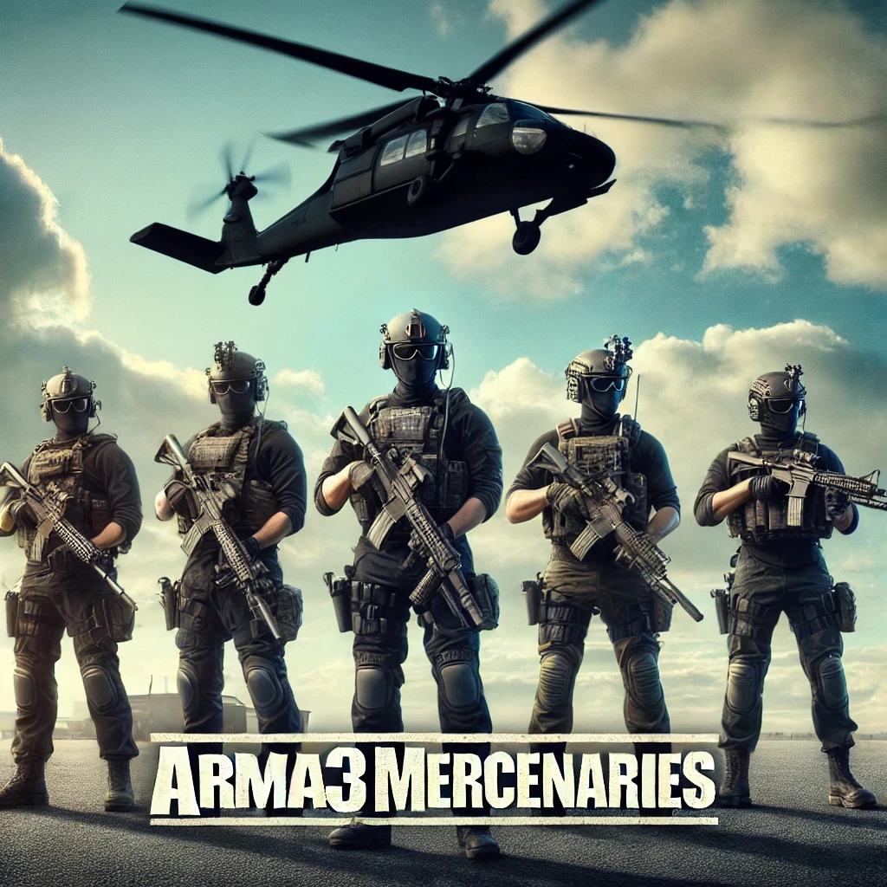

# arma3mercenaries

- **AI Unit Recruitment:** Recruit from different factions and create your own unique mercenary group!
- **Kill Reward System:** You are rewarded and penalized for kills.  
- **Persistent Wallet and Banking System:** Manage your finances through a detailed economic system.
- **Persistent Player Inventory:** All items and equipment are remembered session after session.
- **Persistent Player Groups:** Groups are saved, allowing you to maintain team dynamics.
- **Persistent Group Member Inventories:** Each member’s inventory is saved, ensuring team resources are available.
- **Persistent Vehicles Garages:** Vehicles stored in garages are saved, including their state and inventory.
- **Persistent Open World Player-owned Vehicles:** Vehicles left on the battlefield are saved.
- **Persistent Open World Player-owned Static Weapons:** Static weapons placed in the world are persistent.
- **Persistent Fortification System:** Build custom bases and FOBs that are persistent.
- **Persistent Player Containers:** Player-placed (through fortification system) storage containers and other elements remain in place with all inventory items.

and much more...

# [WIKI](https://github.com/BrianV1981/arma3mercenaries/wiki) for more information