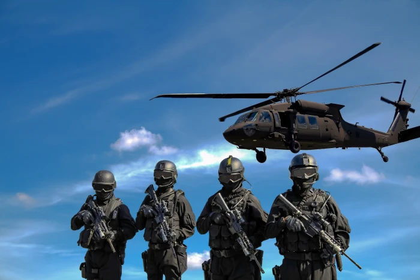

# arma3mercenaries

* AI Unit Recruitment
* Kill Reward System
* Store System
* Persistent Wallet and Banking System
* Persistent Player Inventory
* Persistent Vehicles Garages
* Persistent Garage Vehicle Inventories
* Persistent Fortification System (player made bases)

and much more...

# [WIKI](https://github.com/BrianV1981/arma3mercenaries/wiki) for more information